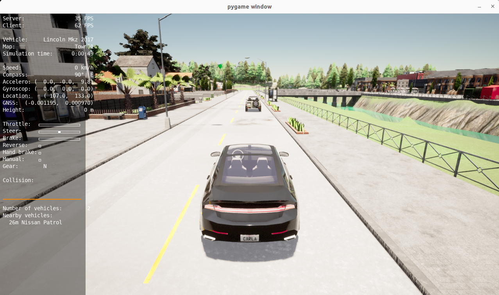

# Carla Dockers

## Carla Docker Image
*Note:* Carla has [official instructions](https://github.com/carla-simulator/carla/blob/master/Util/Docker/README.md) for docker. Caution that as of Nov 2023, this link builds carla with ubuntu 18 so may not be compatible for other packages such as ROS2.

This repo provide a more compatible docker using either 
[Debian Installation](https://carla.readthedocs.io/en/latest/start_quickstart/#a-debian-carla-installation)
, which supports up to 0.9.13 as of last checking, and
[Package Installation](https://carla.readthedocs.io/en/latest/start_quickstart/#b-package-installation),
which supports up to the latest version.
- base image: nvidia/vulkan:1.3-470 (ubuntu 20.04, python 3.8)
- cuda 11.4

#### Prerequisites
Similar to carla official docker prerequisites
* Install docker following instructions [here](https://docs.docker.com/engine/install/)
* Install nvidia-docker2 following instructions [here](https://docs.nvidia.com/datacenter/cloud-native/container-toolkit/install-guide.html#installation-guide)

#### Getting the docker image
Build the docker locally (may take a very long time)
```commandline
sudo docker build -t cisl/carla_deb:0.9.13 --file ./carla_deb.Dockerfile .
sudo docker build -t cisl/carla:0.9.15 --file ./carla.Dockerfile .
```
Or pull the 
[prebuilt carla_deb image](https://hub.docker.com/r/hangqiu/carla/tags),
or 
[prebuilt carla image](https://hub.docker.com/r/cisl/carla/tags).

#### Run carla simulator
* Run the carla server
```commandline
sudo docker run --privileged --gpus all --net=host -e DISPLAY=$DISPLAY \
    -v /usr/share/vulkan/icd.d:/usr/share/vulkan/icd.d \
    cisl/carla:0.9.15 \
    /bin/bash CarlaUE4.sh
```
* Clone the [carla repo](https://github.com/carla-simulator/carla), 
then run the carla client without docker (tested with ubuntu22.04 and python3.10)
```commandline
pip3 install carla==0.9.15 ### install carla PythonAPI PyPi package
python3 <path-to-carla-root>/PythonAPI/examples/manual_control.py
```
* Or run carla client with manual control
```commandline
sudo docker run -it --privileged --gpus all --net=host -e DISPLAY=$DISPLAY \
    -v /usr/share/vulkan/icd.d:/usr/share/vulkan/icd.d \
    cisl/carla:0.9.15 \
    /bin/bash 
```
* In docker, run
```commandline
python3.7 ./PythonAPI/examples/manual_control.py
```
TODO: direct launch python in deb docker 0.9.13 is working, 
launching python3.7 from package docker 0.9.15 is not working.

## Scenario Runner Docker Image

#### Getting the docker image

Build the docker locally. The scenario docker image is built on top of the carla image. [Get the carla image](#carla-docker-image) first before proceeding.
```commandline
sudo docker build -t cisl/srunner:0.9.15 --file ./srunner.Dockerfile .
```
Or pull the [prebuilt image](https://hub.docker.com/r/cisl/srunner/tags).

#### Run Scenario Runner 

Start the carla server
```commandline
sudo docker run --privileged --gpus all --net=host -e DISPLAY=$DISPLAY \
    -v /usr/share/vulkan/icd.d:/usr/share/vulkan/icd.d \
    cisl/carla:0.9.15 \
    /bin/bash CarlaUE4.sh
```
Run a scenario,
```commandline
sudo docker run -it --privileged --gpus all --net=host -e DISPLAY=$DISPLAY \
    -v /usr/share/vulkan/icd.d:/usr/share/vulkan/icd.d  \
    cisl/srunner:0.9.15  \
    /bin/bash
```
In the docker, run
```commandline
python3.7 scenario_runner.py --scenario FollowLeadingVehicle_1 --reloadWorld
```
This starts the scenario *FollowLeadingVehicle_1*. Check out [more scenarios](https://github.com/carla-simulator/scenario_runner/tree/master/srunner/scenarios) to run.

Now start a manual control agent
```commandline
sudo docker run -it --privileged --gpus all --net=host -e DISPLAY=$DISPLAY \
    -v /usr/share/vulkan/icd.d:/usr/share/vulkan/icd.d \
    cisl/srunner:0.9.15 \
    /bin/bash
```
In the docker, run
```commandline
python3.7 manual_control.py
```


*Note:* This is the manual_control from the scenario runner, not exactly the same one from carla/PythonAPI/example mentioned above.

The task of this scenario *FollowLeadingVehicle_1* is to drive behind the leading vehicle and finish the road segment. 

After finishing the task, or timed out (timer starts from scenario launch, **not** manual_control launch), the scenario will terminate itself.
